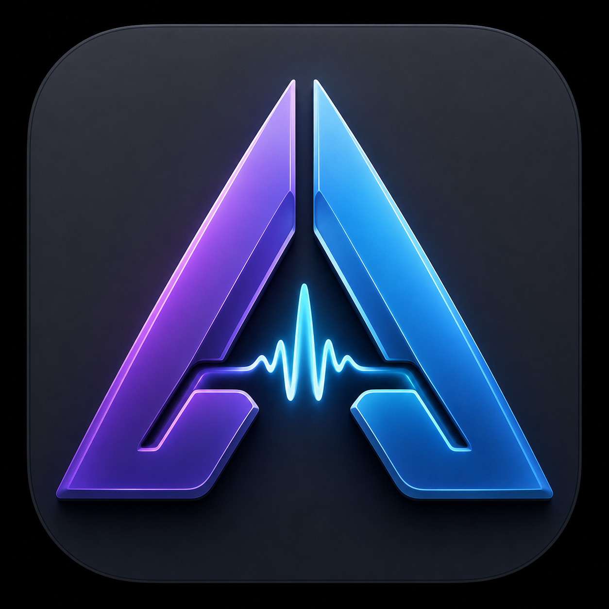

# MiddleAI

<p align="center">
  
</p>

[](https://github.com/sschluet/middleai/actions/workflows/ci.yml)
[](LICENSE)

**Website:** [sschluet.github.io/middleai](https://sschluet.github.io/middleai/)

MiddleAI is a local-first macOS voice layer for dictation and spoken AI requests. It recognizes speech locally, selects the appropriate conversation automatically, streams answers from your own OpenWebUI, the OpenAI Platform or OpenRouter, and speaks complete sentences locally on the Mac.

Tap the left Option key to start dictation and tap it again to finish, or hold it for push-to-talk. The right Option key works the same way for spoken requests to the configured AI provider. A focus-free overlay directly below the MacBook notch shows recording, transcription and response status.

## Download

Ready-to-run Apple Silicon builds are available under [GitHub Releases](https://github.com/sschluet/middleai/releases). Download `MiddleAI-<version>-macOS-arm64.zip`, unpack it and move `MiddleAI.app` to `/Applications`.

The current development releases are ad-hoc signed but not yet Developer-ID signed or notarized. On first launch, macOS can therefore require right-clicking `MiddleAI.app` and choosing **Open**. Microphone and Accessibility permissions, provider credentials and local speech models must be configured separately on every Mac.

Each release includes a SHA-256 checksum file and a machine-readable Swift dependency inventory. Models are downloaded on first use and are never included in the release archive.

## What is included

- Native SwiftUI menu-bar app with first-run settings, quick input, status, profiles and current-chat link
- Native push-to-talk handling for the separate left and right Option keys
- Local Parakeet TDT v3 multilingual speech recognition through FluidAudio and Core ML
- Native 258-point island that overlaps the MacBook camera notch seamlessly, with rounded top and bottom transitions, macOS-sized typography, target-app icon and seven-bar level meter
- Silent dismissal for accidental, too-short or empty Option-key recordings
- Optional on-device dictation polishing with Apple Intelligence to remove filler words, repetitions and slips before insertion
- Conservative spoken formatting commands for configurable target applications, including paragraphs, line breaks, German quotation marks, punctuation and rich lists
- Focus-restoring, clipboard-preserving text insertion with app-tuned timing for plain and rich text
- Shared Swift core plus `middleai` CLI
- Loopback-only synchronous `POST /input` plus queued `POST /command` for optional local integrations
- SQLite conversation/message cache and profile state
- `HeuristicRouter`, `EmbeddingRouter`, `LLMRouter` and default `HybridRouter`
- Password and API-key auth providers; passwords/tokens live in macOS Keychain
- Selectable answer provider: OpenWebUI, OpenAI Platform or OpenRouter
- Model discovery after authentication and streaming responses for all providers
- API keys and passwords stored only in macOS Keychain
- OpenWebUI adapter with TLS validation, optional private CA and server-side chat persistence
- Dedicated Devices settings with macOS-default or fixed microphone and speaker routing
- Supertonic 3 multilingual TTS with native Core ML inference, automatic German/English pronunciation, spoken German number normalization, five female voices, 44.1-kHz audio, local macOS fallback and immediate barge-in
- Structured privacy-safe logging, in-app diagnostics, redacted support export and `middleai doctor`

## Install and build

### System requirements

| Component | Minimum | Recommended |
| --- | --- | --- |
| Mac | Apple Silicon M1 | M2 or newer for faster local speech generation |
| macOS | macOS 14 Sonoma | Current macOS release |
| Memory | 8 GB for dictation and Supertonic | 16 GB for Qwen3-TTS, 24 GB for Voxtral or heavy multitasking |
| Free disk space | 5 GB for one compact voice setup | 12–15 GB for all current models, downloads and temporary files |
| Network | Required for initial model downloads and the selected answer provider | Stable broadband connection for first setup |

The distributed app is currently arm64-only and does not run on Intel Macs. Apple Intelligence based dictation polishing and spoken-response summaries require macOS 26, Apple Intelligence and an eligible Mac. On macOS 14 and later, MiddleAI remains usable and falls back to conservative local text cleanup and extractive summaries.

Building from source additionally requires Swift 6 Command Line Tools or Xcode:

```sh
cd ~/Codex/middleai
./setup.sh
open dist/MiddleAI.app
```

The setup builds an ad-hoc signed local `.app`, places the CLI at `dist/bin/middleai`, and creates `~/.middleai/config.yaml`. Nothing is installed system-wide.

The first launch downloads the Parakeet Core ML STT model and the selected TTS model once. Both run locally after those downloads. Settings → Speech shows download progress plus installed, incomplete, repair-required and locally updated states for every managed TTS model. Model manifests record the source, exact downloaded revision, license, expected artifacts, runtime versions and the last successful startup. Installed or partial downloads can be repaired, updated or moved to the macOS Trash; MiddleAI never deletes the shared managed runtime with an individual voice model. Managed Python runtime packages are pinned to exact versions and SHA-256 hashes; installation fails closed when a downloaded wheel does not match the lock file.

Voxtral remains available only after an explicit CC BY-NC 4.0 acknowledgement. If an older configuration selects Voxtral without that acknowledgement, MiddleAI safely switches to the local macOS voice. This is intended to prevent accidental business use of a non-commercial model.

### Local intelligence and chat routing

Settings → Intelligence separates conversation routing from answer generation. The provider selected under Settings → Connection always generates the actual answer. MiddleAI only decides whether an input continues the current conversation, switches to a recent one or starts a new chat.

The Hybrid strategy first compares recency, wording and local text similarity. If those signals disagree, one optional local intelligence source can break the tie:

- **Apple Intelligence** uses the on-device macOS Foundation Model on supported macOS 26 systems. If it is unavailable, Hybrid safely falls back to its built-in rules.
- **Ollama** uses its local `/v1` chat-completions API, normally at `http://127.0.0.1:11434`, with an already downloaded model such as `qwen3:4b`.
- **llama.cpp** uses a local `llama-server` or router with the same `/v1` endpoints. MiddleAI defaults this option to `http://127.0.0.1:18881` and calls `/v1/models` plus `/v1/chat/completions`.
- **MiddleAI rules only** disables the optional model and requires no separate AI runtime.

For Ollama or llama.cpp, the configured model ID or alias must be known to the server. A successful connection test with an empty `/v1/models` response means the server is reachable, but no model is currently advertised. Only the current input and the titles and summaries of up to eight recent local conversations are sent to this loopback service.

### Copying MiddleAI to another Mac

`MiddleAI.app` contains the native application and its Swift dependencies. Copying only the app to `/Applications` on another Apple Silicon Mac is sufficient to start setup; Xcode, Homebrew and a separately installed Python are not required. Qwen3-TTS and Voxtral bootstrap their own managed Python/MLX runtime under `~/.middleai/runtime`.

The current development build is ad-hoc signed, not Developer-ID signed or notarized. Gatekeeper can therefore require right-clicking the app and choosing **Open**. A regular organizational release should be Developer-ID signed, notarized and distributed as a signed DMG or ZIP.

The following data deliberately does not travel inside the app and must be configured on each Mac:

- answer provider, model ID and any OpenWebUI server settings
- API keys or passwords, which remain in macOS Keychain
- microphone and speaker, either following the current macOS default or pinned by Core Audio UID
- Password or API token stored in that Mac's Keychain
- Microphone and Accessibility permissions
- Activation keys and user preferences under `~/.middleai`
- STT and TTS model caches

After the initial downloads, speech recognition and speech synthesis work offline. Assistant requests still require access to the configured OpenWebUI, OpenAI or OpenRouter endpoint.

### Local model storage

| Component | Approximate installed size |
| --- | ---: |
| MiddleAI.app | 60 MB |
| Parakeet TDT v3 STT including Core ML data | 1 GB |
| Supertonic 3 | 0.2–0.4 GB |
| Qwen3-TTS 4-bit plus managed runtime | 2.8 GB |
| Voxtral 4-bit plus managed runtime | 3 GB |
| All listed TTS models including PocketTTS plus STT | 9–10 GB plus temporary download space |

Sizes are rounded and can change with upstream model revisions. Old model versions remain in the user's cache until removed and can increase total disk use. Voxtral is licensed under CC BY-NC 4.0 and must not be used for commercial or business purposes.

## First start

1. Open `dist/MiddleAI.app`; MiddleAI appears in the menu bar.
2. Open **Settings**.
3. Choose OpenWebUI, OpenAI Platform or OpenRouter. Enter the required password or API key, then use **Authenticate and load models** to select a model returned by the provider.
4. Keep TLS verification enabled. Add a company CA PEM/DER path when required.
5. Select **Save & Test Connection**.
6. Allow MiddleAI under **Privacy & Security** for Microphone and Accessibility. Restart MiddleAI if macOS asks for it.
7. Tap left Option, speak and tap it again to insert dictation into the active field. Holding and releasing also works.
8. Use right Option the same way to ask the configured provider. MiddleAI displays and speaks the response.

OpenAI and OpenRouter credentials are API keys, not consumer subscription logins. MiddleAI stores them under provider-specific Keychain accounts and never writes them to `~/.middleai/config.yaml`. OpenRouter uses its authenticated user-model endpoint when available so the picker reflects account privacy and routing preferences; it falls back to the public model catalog if that endpoint is unavailable.

Settings → Devices owns audio routing. Choosing **macOS default** follows subsequent system changes automatically. Choosing a concrete microphone keeps recording on that Core Audio device. Choosing a concrete speaker routes MiddleAI-generated audio through that device without changing the global macOS default; if the device disappears, playback falls back to the system output.

The Voice settings contain **Diktat vor dem Einfügen lokal glätten**. On macOS 26, this uses Apple's on-device Foundation Model with German locale support. MiddleAI accepts a generated correction only when numbers and protected terms remain present, the vocabulary stays close to the transcript and no substantial new wording is introduced. Otherwise it keeps a conservative local cleanup that only removes filler sounds and direct repetitions. Dictation text is never sent to OpenWebUI or another cloud service for polishing.

Settings → Spracheingabe documents the active STT stack and exposes the useful Parakeet TDT v3 controls. The microphone picker can follow the macOS default or pin one connected Core Audio input device, which prevents a display, headset or conference speaker from silently taking over recording. German mode keeps the decoder in a compatible Latin script, while multilingual mode removes that restriction. The int8 encoder is the recommended accuracy setting; int4 uses less storage. Automatic acceleration lets Core ML select CPU, GPU and Neural Engine, while the compatibility option restricts execution to CPU and GPU. For recordings longer than roughly 30 seconds, accurate long-form mode locally compares additional decoding paths at the cost of some processing time. A recording that contains no measurable input now identifies the selected microphone instead of disappearing silently.

### Spoken formatting in selected apps

MiddleAI can translate explicit German structure commands into formatted output. Microsoft Word (`com.microsoft.Word`), Microsoft PowerPoint (`com.microsoft.Powerpoint`), Microsoft Outlook (`com.microsoft.Outlook`) and Proton Mail (`ch.protonmail.desktop`) are enabled by default. Under Settings → Spracheingabe, each default can be disabled and additional installed `.app` bundles can be selected. MiddleAI stores only their bundle identifiers.

- `neue Zeile` inserts a line break; `neuer Absatz` starts a new paragraph.
- `in Anführungsstrichen Projekt Apollo` becomes `„Projekt Apollo“`.
- `Anführungszeichen auf … Anführungszeichen zu` and `Zitat Anfang … Zitat Ende` create paired German quotation marks.
- `Aufzählung, Punkt eins …, nächster Punkt …, Liste Ende` creates a bulleted list.
- `Aufzählung: 1. …, zweitens … und drittens …` also creates a bulleted list.
- Starting with `nummerierte Liste` creates an ordered list.
- Spoken `Komma`, `Doppelpunkt`, `Semikolon`, `Fragezeichen`, `Ausrufezeichen` and `Satzende` are converted conservatively.

MiddleAI restores the application that was active when recording started, waits until it is focused, then pastes the transcript with app-specific timing. Rich output places plain text, HTML and RTF representations on the pasteboard so Word, PowerPoint, Outlook and Proton Mail can preserve lists and paragraphs. The previous clipboard contents are restored only after the paste has completed. Detection is deliberately conservative: ordinary wording such as `Die neue Zeile ist rot` is not interpreted as a command, and all other applications continue to receive plain text only.

The password is written to Keychain service `de.middleai.openwebui`, never to YAML. For development only, `MIDDLEAI_OPENWEBUI_PASSWORD` may be set from a gitignored `.env`-style shell environment.

## CLI

```sh
dist/bin/middleai ask "Wie hoch war nochmal die Förderleistung?"
dist/bin/middleai status
dist/bin/middleai new
dist/bin/middleai stop
dist/bin/middleai conversations
dist/bin/middleai doctor
dist/bin/middleai tts-use-supertonic
dist/bin/middleai tts-use-pocket
dist/bin/middleai tts-prepare
dist/bin/middleai tts-render ~/.middleai/tts-test.wav
dist/bin/middleai tts-test
dist/bin/middleai api-secure
dist/bin/middleai api-token
dist/bin/middleai serve
```

`serve` runs the same loopback HTTP adapter without the menu-bar app. Do not run both on the same port.

## Local HTTP input

```sh
curl http://127.0.0.1:8765/input \
  -H "Authorization: Bearer $(dist/bin/middleai api-token)" \
  -H 'Content-Type: application/json' \
  -d '{"text":"Und wie sieht es mit Gardena aus?","source":"local-integration"}'
```

The server refuses configuration on `0.0.0.0`. New installations require a random local bearer token by default. It is stored separately from OpenWebUI credentials under the Keychain account `local_http_token`. Existing configurations keep their explicit setting; `middleai api-secure` enables authentication and prints the token. The bundled `middleai-input` and `middleai-ask` scripts read that token from Keychain automatically.

`POST /command` remains available for optional local automation and returns `202 Accepted` plus a request ID immediately. `GET /requests/{id}` reports its state and `POST /requests/{id}/cancel` cancels queued or active work. `/health` provides a content-free readiness check. Request size, timeout, concurrency and queue depth are bounded. These endpoints are not used by either native Voice mode.

## Conversation routing

Commands such as “Neuer Chat”, “Stopp”, “Nicht vorlesen”, “Zurück zum MacBook-Thema” and “Architekturmodus” are intercepted locally. Normal input is scored against the current and recent chats using time, title, summary, recent user/assistant messages and local semantic similarity. The hybrid router combines heuristic and vector decisions and can optionally ask a local `/v1/chat/completions` routing model. If that model is unavailable, the heuristic path remains operational.

The local router only returns a routing decision; it is never asked to answer the user. Confidence thresholds and continuation timeout are configurable in `~/.middleai/config.yaml`. The file contains schema-versioned JSON, which is valid YAML 1.2 and safely preserves quotes, hashes and arrays. Existing legacy files are migrated once with a `.legacy-backup` copy. MiddleAI enforces `0700` on its data directory and `0600` on the configuration file.

## TTS and privacy

`adaptive` is the default. It combines a natural local neural voice with the reliable German Apple voice for longer texts, numbers and difficult terminology. `supertonic3` can be selected directly and uses a multilingual Core ML model with explicit German synthesis, 44.1-kHz output and five female reference styles. Selecting a style in Settings immediately plays the same German sample, making the voices directly comparable. The model download is about 400 MB and is reused offline after the first preparation.

`pockettts` remains available for compatibility, but several of its styles can have a noticeable accent in German. A complete response is synthesized into one continuous WAV before playback to avoid player restarts between sentences. Audio is synthesized and played inside MiddleAI; no Python process, local server or cloud service is involved.

`macos` remains a completely local fallback. MiddleAI lists the installed German Apple voices with gender and quality information. Additional Apple voices can be opened for download from the Speech settings. `local_model` remains available for an optional custom executable. New user input interrupts playback and clears pending speech immediately.

In `smart_summary` mode MiddleAI waits for the complete provider response and then asks Apple Intelligence for a short grounded German spoken summary. The prompt contains the actual response text and preserves conclusions, important figures, risks and next steps. If Apple Intelligence is unavailable or rejects the request, a deterministic local fallback ranks relevant conclusion and recommendation sentences across the response instead of reading only its opening paragraph.

STT microphone audio remains in memory and is never sent to an answer provider. Only the finished assistant-mode transcript and required local conversation context are sent to the configured provider. Dictation-mode transcripts never leave the Mac.

## Tests and diagnostics

```sh
make test
dist/bin/middleai doctor
```

The portable test runner covers configuration migration and permissions, HTTP parsing and security, SQLite, command detection, formatting, routing, TTS queue/barge-in, OpenWebUI streaming, fallback and cancellation. An additional XCTest target provides structured IDE/CI reporting and coverage when a full Xcode toolchain is available. Standalone Command Line Tools can continue to use `make test` because that environment does not ship an importable XCTest module.

Settings → Diagnose checks permissions, configuration rights, disk space, local API protection, the selected OpenWebUI model and connection. Its support report deliberately omits credentials, prompts and responses and redacts server URLs. Settings → Hilfe can inspect and delete the local routing cache without deleting canonical conversations in OpenWebUI. The cache defaults to a 90-day retention period; 30 days, one year or permanent local retention can be selected there.

See [ARCHITECTURE.md](ARCHITECTURE.md), [SECURITY.md](SECURITY.md) and [DEVELOPMENT.md](DEVELOPMENT.md) for implementation and maintenance details.

## License

MiddleAI source code is licensed under the [Apache License 2.0](LICENSE). Third-party libraries and optional downloaded speech models retain their own licenses; see [THIRD_PARTY_NOTICES.md](THIRD_PARTY_NOTICES.md). In particular, the optional Voxtral model is CC BY-NC 4.0 and is not permitted for commercial or business use.
